**GitHub repository:** <https://github.com/khushidonda/DATA266-Lab1-Khushi-Dipin>

**Team ownership.** Khushi led Task 1, Dipin led Task 2, and both team members independently developed and evaluated models for Task 3.

# 1. Summary

| Task | Model(s) | Headline result |
|---|---|---|
| 1. GPT from scratch (TinyStories, character level) | 4-block decoder-only Transformer, 574,830 parameters | validation cross-entropy 0.8643 nats/char, perplexity 2.373, 1.247 bits per character, top-1 accuracy 72.75% |
| 2. Yelp Polarity sentiment | 1-layer LSTM, 2-layer BiLSTM, BiLSTM + attention (about 8.2 to 8.8 M parameters each) | test accuracy 0.9518 / 0.9531 / 0.9533, macro-F1 0.9518 / 0.9531 / 0.9533 |
| 3. CycleGAN, Monet and photo | Khushi: ResNet-9 CycleGAN, 28.29 M parameters. Dipin: ResNet-9 CycleGAN, 28.27 M parameters, two versions | course evaluator average FID 98.61 (Khushi), 102.39 (Dipin v2), 100.41 (Dipin v1); team leaderboard rank 29, score $-49.5121$ |

Every number in this report is read from an artifact in the repository; section 6 maps results to files, checkpoints and SHA-256 values. Statistical statements are stated with their sample sizes, and evaluation protocols are named wherever they differ between models.

# 2. Task 1 — GPT-style language model from scratch

## 2.1 Objective, data and preprocessing

The task is next-character prediction with a decoder-only Transformer implemented without any prebuilt Transformer or attention module. The data are 100,000 training and 10,000 validation stories sampled with seed 42 from the 2,119,719-story training split of TinyStories (Eldan and Li, 2023; Hugging Face revision `f54c09fd`). The tokenizer is a from-scratch character vocabulary of 110 symbols built from the training stories only, with `char_to_idx` and `idx_to_char` dictionaries. Each story is cut into non-overlapping windows of 129 characters (input = first 128, target = the same window shifted by one), giving 644,854 training and 64,576 validation sequences (82.5 M and 8.3 M target characters).

## 2.2 Architecture and hyperparameters

The model follows the pre-layer-norm GPT design (Vaswani et al., 2017): a trainable token embedding (110 x 128) plus a learned positional embedding (128 x 128), four Transformer blocks and a final layer norm with a linear language-modelling head. Each block applies `x = x + Attn(LN(x))` and `x = x + FFN(LN(x))`. Multi-head causal self-attention is written by hand: separate query, key, value and output projections, scaled dot-product scores, a lower-triangular mask applied with `masked_fill(-inf)` before the softmax, and a manual head split and merge. The feed-forward layer is Linear(128, 256), GELU, Linear(256, 128).

| Item | Value |
|---|---|
| Sequence length / embedding dim / heads / blocks / feed-forward dim | 128 / 128 / 4 (32 per head) / 4 / 256 |
| Dropout | 0.1 (embedding, attention, residual, feed-forward) |
| Parameters | 574,830 |
| Optimizer | AdamW, learning rate $3\times10^{-4}$, weight decay 0.01 |
| Schedule | 1,000 linear warm-up steps, then cosine decay to 0 at step 100,760 |
| Batch size / epochs / steps | 64 / 10 / 100,760 (10,076 per epoch) |
| Loss, precision, clipping | cross-entropy, FP32, no gradient clipping |
| Generation | temperature 0.8, 200 new characters, 5 prompts x 10 samples, seed 42 |
| Hardware / software | NVIDIA GeForce RTX 5090, PyTorch 2.14.0 with CUDA 13.0 (Docker image `khushi-task1-gpu:torch2.14-cu130`) |
| Seed | 42 |

## 2.3 Results

The study evaluates one locked configuration; the final model is the epoch-9 checkpoint, which also has the lowest validation loss (checkpoint `epoch_9.pt`, SHA-256 `5bd9af9b…d398b`).

| Metric | Validation | Training (eval mode) |
|---|---|---|
| Cross-entropy (nats/char) | 0.8643 | 0.8639 |
| Perplexity | 2.373 | 2.372 |
| Bits per character | 1.2469 | 1.2463 |
| Generalization gap (val − train CE) | +0.00040 | |
| Top-1 next-character accuracy | 72.75% | 72.76% |
| Distinct-1 / 2 / 3 (character level) | 0.0051 / 0.0436 / 0.1592 | |
| Distinct-1 / 2 / 3 (word level, secondary) | 0.2395 / 0.6463 / 0.8569 | |
| Repeated 4-gram rate (character / word) | 0.1309 / 0.0020 | |
| Gradient norm (all 100,760 steps) | mean 0.408, median 0.413, p99 0.464, max 1.437 (step 126, warm-up) | |
| NaN / Inf events | 0 | |
| Parameters | 574,830 | |
| Training throughput / generation throughput | 307,817 characters/s / 566.4 characters/s (batch 1) | |
| Peak GPU memory | 444.1 MiB allocated (480.0 MiB reserved) | |
| Total training time | 2,705.1 s (45 min 05 s) | |

| Epoch | 0 | 1 | 2 | 3 | 4 | 5 | 6 | 7 | 8 | 9 |
|---|---|---|---|---|---|---|---|---|---|---|
| Train CE (dropout on) | 1.512 | 1.078 | 1.017 | 0.989 | 0.971 | 0.959 | 0.951 | 0.945 | 0.942 | 0.940 |
| Validation CE | 1.043 | 0.954 | 0.918 | 0.899 | 0.885 | 0.877 | 0.871 | 0.866 | 0.865 | 0.864 |

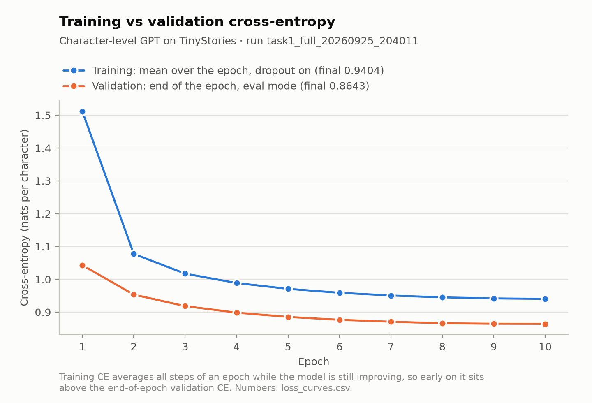{width=78%}

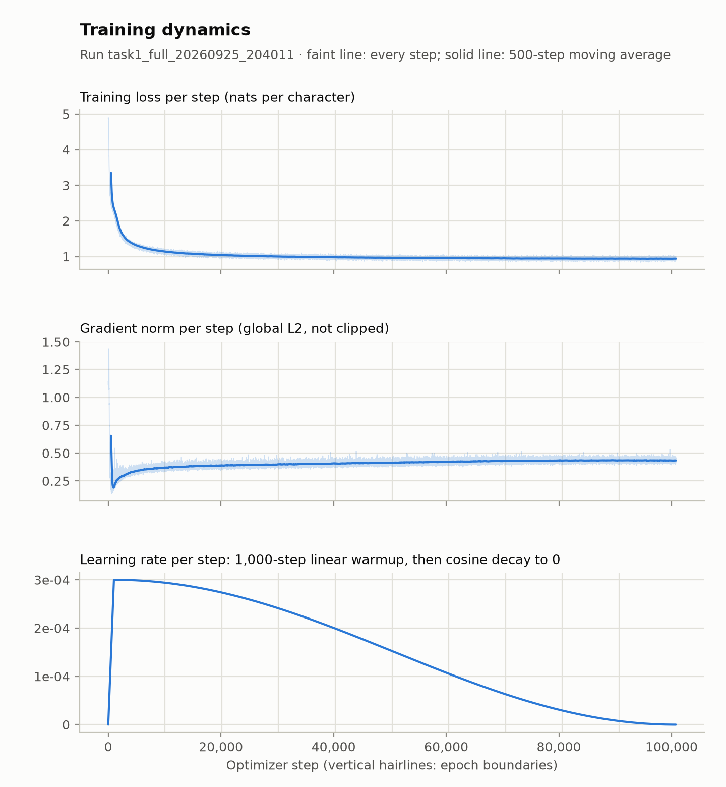{width=62%}

## 2.4 Generation quality and failure analysis

Samples reproduce the surface form of short children's stories: common openings, names, punctuation, dialogue and simple declarative sentences. Three failure cases from the 50 generated samples (`eval_epoch_9/generations.jsonl`) illustrate the main weaknesses.

| Failure type | Generated snippet (prompt in the first words) | Observation |
|---|---|---|
| Phrase and template repetition (sample 8) | "Once upon a time, there was a little girl named Lily. She loved to play in the park. One day, a little girl named Lily went to the park. She made a loud noise…" | The phrase "a little girl named Lily" restarts the same subject description instead of advancing the story: a locally probable template is reused. |
| Semantic incoherence (sample 0) | "…She had a big box to the mountain. One day, her mom saw a big box to sparkle and the spider. They also learned that her name cleaning the boy…" | Syntax and rhythm of a children's story are kept, but phrases such as "a big box to sparkle" do not form coherent relations. |
| Narrative and dialogue coherence (sample 46) | "Tom was sad because he was too high and felt the wallets and the friends laughed inside… said, \"We will write as me fluffer?\"" | Dialogue formatting is preserved while meaning and entity continuity deteriorate. |

## 2.5 Strengths, weaknesses, limitations and next steps

*Strengths.* Optimization is stable over all 100,760 steps (no NaN, maximum gradient norm 1.44 at warm-up) and the evaluation-mode train and validation losses differ by only 0.0004 nats, so there is little evidence of overfitting on this split. A compact 0.57 M-parameter model learns strong local character structure.

*Weaknesses and limitations.* Local fluency is much stronger than long-range coherence: with a 128-character context the model cannot track entities across sentences, and character-level sampling can produce plausible but invalid words (the word-level unseen share is 1.1%). The character-level repeated 4-gram rate (0.131) reflects both genuine template reuse and the small alphabet. One configuration was evaluated, so the effect of context length and capacity is not measured here.

*Next steps.* Hold the evaluation protocol fixed and test longer context windows and larger capacity, and decoding controls that penalize repeated n-grams; treat each as a separate experiment so the reference run stays unchanged.

# 3. Task 2 — Yelp Polarity sentiment classification

## 3.1 Data and preprocessing

The data are `fancyzhx/yelp_polarity`: 560,000 training reviews and 38,000 official test reviews, with no null entries, no duplicates and no invalid labels. A stratified 90/10 split of the training pool (seed 42) gives 504,000 training and 56,000 validation reviews; the test set is untouched. All splits are exactly balanced (50/50). Raw reviews are longer for the negative class (mean 151.5 words, median 112) than for the positive class (mean 114.5, median 84).

Preprocessing runs in this order: unescape literal `\n`, lowercase, expand negation contractions, strip punctuation, whitespace tokenization, NLTK English stopword removal with 11 negation words kept (no, not, nor, never, none, nobody, nothing, neither, nowhere, cannot, without), and WordNet lemmatization. The vocabulary is built on the training split only (minimum frequency 3, cap 40,000, plus `<PAD>` and `<UNK>`, 40,002 entries); sequences are cut to 200 tokens by keeping the first 150 and last 50 (4.46% of test reviews are truncated; the test unknown-token rate is 0.70%). Embeddings are learned from scratch; no pretrained vectors or language models are used.

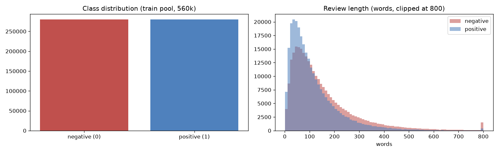{width=92%}

## 3.2 Models and hyperparameters

Three models share the pipeline and differ only in the architecture:

| Model | Architecture | Parameters |
|---|---|---|
| Baseline | Embedding(V, 200), 1-layer unidirectional LSTM(128), hidden state at the true sequence length, dropout 0.3, Linear(128, 1) | 8,169,489 |
| Experimental 1 | Embedding(V, 200), 2-layer BiLSTM (128 per direction, inter-layer dropout 0.3), concatenated final forward and backward states, dropout, Linear(256, 1) | 8,733,841 |
| Experimental 2 | The same 2-layer BiLSTM with masked additive (Bahdanau) attention pooling over non-padding steps (attention size 128), dropout, Linear(256, 1) | 8,766,865 |

Shared settings: embedding dimension 200, AdamW (learning rate $2\times10^{-3}$, weight decay $10^{-4}$), 5% warm-up then cosine decay, batch size 256, at most 4 epochs with early stopping on validation macro-F1 (patience 2; best epoch 3 for all three), BCE-with-logits loss, embedding dropout 0.2, dropout 0.3, gradient clipping 1.0, seed 42, threshold 0.5. Hardware: NVIDIA GeForce RTX 5090 and Intel Core Ultra 9 285K, PyTorch 2.11.0 with CUDA 12.8.

## 3.3 Results

| Metric (38,000 test reviews) | Baseline | Experimental 1 | Experimental 2 |
|---|---|---|---|
| Accuracy (= micro precision, recall and F1) | 0.9518 | 0.9531 | 0.9533 |
| Precision, macro (= weighted) | 0.9518 | 0.9531 | 0.9533 |
| Recall, macro (= weighted) | 0.9518 | 0.9531 | 0.9533 |
| F1, macro (= weighted) | 0.9518 | 0.9531 | 0.9533 |
| ROC-AUC | 0.9890 | 0.9901 | 0.9903 |
| PR-AUC | 0.9889 | 0.9902 | 0.9903 |
| Matthews correlation (MCC) | 0.9036 | 0.9062 | 0.9066 |
| Brier score | 0.0376 | 0.0364 | 0.0360 |
| Expected calibration error (10 bins) | 0.0149 | 0.0157 | 0.0144 |
| 95% CI, accuracy | [0.9496, 0.9539] | [0.9511, 0.9551] | [0.9512, 0.9554] |
| 95% CI, macro-F1 | [0.9496, 0.9539] | [0.9511, 0.9551] | [0.9512, 0.9554] |
| 95% CI, MCC | [0.8993, 0.9078] | [0.9021, 0.9102] | [0.9023, 0.9108] |
| Confusion matrix (TN / FP / FN / TP) | 18,064 / 936 / 896 / 18,104 | 18,150 / 850 / 932 / 18,068 | 18,167 / 833 / 941 / 18,059 |
| Parameters | 8,169,489 | 8,733,841 | 8,766,865 |
| Training time (s) / training examples per second | 167.4 / 12,046 | 543.1 / 3,712 | 693.3 / 2,908 |
| Inference examples per second | 86,703 | 32,300 | 27,278 |
| Peak GPU memory (MiB) | 577 | 979 | 980 |
| Peak host memory (GiB) | 3.66 | 3.68 | 3.79 |

Confidence intervals are from 1,000 bootstrap resamples of the test set. Checkpoints: `task2_sentiment/dipin/checkpoints/baseline.pt`, `experimental_1.pt` and `experimental_2.pt` (SHA-256 `e6cba920…`, `d1fbe654…`, `c3f4da85…`).

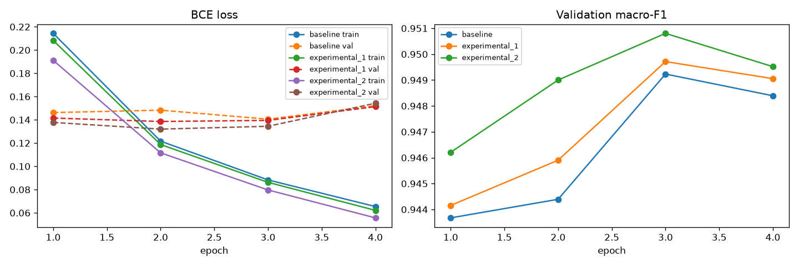{width=95%}

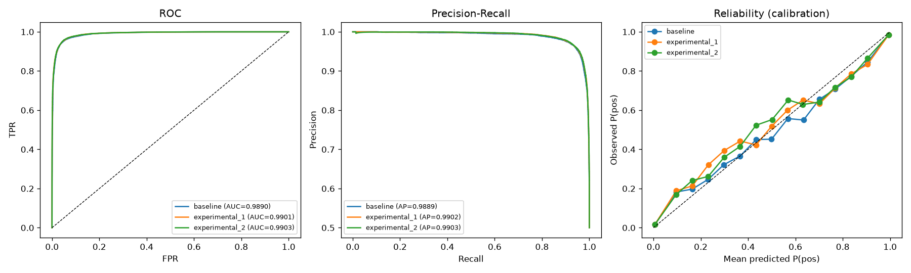{width=95%}

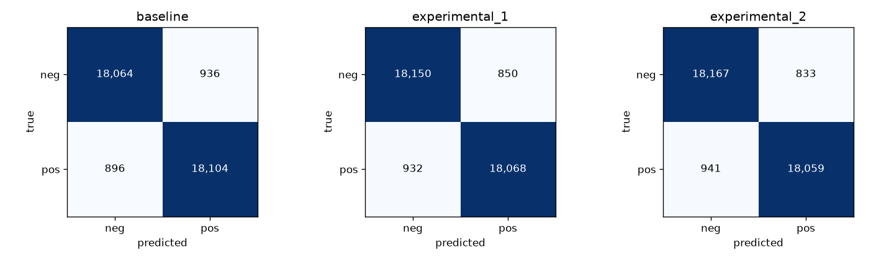{width=88%}

**Paired McNemar test** (exact binomial test on the discordant pairs, 38,000 test reviews):

| Comparison | A right, B wrong | A wrong, B right | p-value |
|---|---|---|---|
| Baseline vs Experimental 1 | 373 | 423 | 0.0824 |
| Baseline vs Experimental 2 | 430 | 488 | 0.0599 |
| Experimental 1 vs Experimental 2 | 431 | 439 | 0.8124 |

None of the three comparisons is statistically significant at the conventional 0.05 level; the baseline versus experimental 2 comparison is borderline. The accuracy differences (0.0013 and 0.0015) are about the size of the bootstrap interval half-width (about 0.002), so the three models should be regarded as close in accuracy, with the BiLSTM models somewhat better in probability quality (Brier score, AUC).

**Robustness by data slice** (macro-F1 / error rate):

| Slice (n) | Baseline | Experimental 1 | Experimental 2 |
|---|---|---|---|
| all (38,000) | 0.9518 / 4.82% | 0.9531 / 4.69% | 0.9533 / 4.67% |
| short reviews, 65 words or fewer (12,776) | 0.9488 / 4.97% | 0.9506 / 4.80% | 0.9492 / 4.93% |
| medium, 65 to 142 words (12,649) | 0.9529 / 4.71% | 0.9534 / 4.66% | 0.9553 / 4.47% |
| long, over 142 words (12,575) | 0.9507 / 4.78% | 0.9523 / 4.61% | 0.9524 / 4.60% |
| contains a negation (28,526) | 0.9494 / 4.91% | 0.9506 / 4.79% | 0.9515 / 4.70% |
| contains a contrast word (22,551) | 0.9467 / 5.28% | 0.9484 / 5.11% | 0.9483 / 5.12% |
| truncated, over 200 tokens (1,694) | 0.9303 / 6.14% | 0.9361 / 5.61% | 0.9250 / 6.61% |
| high unknown-token rate, over 10% (231) | 0.8442 / 13.85% | 0.8421 / 13.85% | 0.8333 / 14.72% |

Experimental 2 has the best overall metrics but the highest error on the truncated and high-unknown slices, so its overall advantage does not extend to long or non-English reviews.

## 3.4 Error review (experimental 2)

Experimental 2 misclassifies 1,774 of 38,000 reviews (4.67%). Twenty errors were selected automatically (not by hand): the 5 most confident false positives, the 5 most confident false negatives, the 5 errors closest to $P=0.5$ and the 5 most confident errors in the worst slice (high unknown rate). Each was labelled with an error type (`task2_sentiment/dipin/failure_analysis.md`, candidates in `outputs/error_review/error_candidates_experimental_2.csv`).

| Error type | Count | Example (test index) |
|---|---|---|
| Mixed review (praise and complaints in one review) | 7 | #5185, "But like Clay I did not love the ones that I got … It is definitely a worthwhile destination for a pancake lover." True label negative, $P(\text{pos}) = 0.9995$ |
| Unknown words (non-English text, links, broken accents) | 5 | slice errors #1256, #36104, #35963, #19328, #27150, all with $P(\text{pos}) > 0.99$ |
| Sentiment about something else | 3 | strong words aimed at other reviewers, earlier owners or other customers |
| Label noise | 2 | #29330, "Wow love the place and everything is very clean and new!" labelled negative |
| Indirect negative | 2 | #29923, "I would recommend just about every other froyo joint than this one." |
| Too little signal | 1 | very short neutral text near $P=0.5$ |

Patterns: most errors are hard rather than random (7 of 20 are mixed reviews, and 4 of the 5 near-threshold errors are mixed); some are label problems (#29330 and one more); and the stopword list removes contrast words that carry meaning (*but, than, other, now, before*): reviews that contain "but" have a 5.16% error rate (n = 20,227) against 4.11% for the rest (n = 17,773). The accented characters stored as `\uXXXX` codes are damaged by the cleaner for 879 test reviews (2.3%), whose error rate is 7.39%.

**Testable fix.** Remove *but, than, other, now, before, only, too* from the stopword list (as negations already are), retrain experimental 2 with the same configuration and seed, and compare on the same 38,000 reviews: the error rate on "but" reviews should fall, the error rate on the others should not rise, and a paired McNemar test of old versus new should give $p<0.05$. A second, smaller fix is to decode the `\uXXXX` codes before cleaning and replace links by a single `<url>` token. Two of the 20 errors are label noise that no model change can fix.

## 3.5 Strengths, weaknesses, limitations and next steps

*Strengths.* All three models reach about 95% accuracy and AUC near 0.99 with embeddings learned from scratch, and calibration is good (ECE about 0.015). Experimental 2 is best on every aggregate metric.

*Weaknesses and limitations.* The gains from depth, bidirectionality and attention are small and not significant by McNemar's test; they cost 3.3 to 4.1 times the training time. Training used at most 4 epochs, with the best validation epoch at 3 for every model. Errors concentrate in mixed, non-English and truncated reviews, and part of the problem is caused by the preprocessing choices above.

*Next steps.* The stopword fix above, a language filter or character-level fallback for non-English text, and longer-context or hierarchical pooling for the truncated slice.

# 4. Task 3 — CycleGAN image style transfer (Monet and photos)

Both team members independently implemented a CycleGAN (Zhu et al., 2017) in PyTorch with two ResNet-9 generators and two 70x70 PatchGAN discriminators trained with an LSGAN objective (Mao et al., 2017) on the Kaggle "I'm Something of a Painter Myself" images (300 Monet paintings, 7,038 photographs, 256 x 256 RGB, not paired). No pretrained network generates or alters any translated image; pretrained Inception-v3 and AlexNet are used only to measure images. To avoid confusion between the two code bases, this section names directions by content: **photo to Monet** and **Monet to photo**.

## 4.1 Models and hyperparameters

| | Khushi | Dipin v2 (final) | Dipin v1 (baseline) |
|---|---|---|---|
| Generators | ResNet-9, reflection padding, InstanceNorm, ReLU, Tanh; transposed-convolution upsampling | same, with nearest-neighbour upsampling plus 3x3 convolution | transposed-convolution upsampling |
| Discriminators | 70x70 PatchGAN, InstanceNorm, raw output | same, plus DiffAugment and gradient-norm clipping at 15 | 70x70 PatchGAN |
| Parameters | 28,285,832 | 28,273,544 | 28,273,544 |
| Loss weights | cycle 10, identity 5 | cycle 10, identity 1 | cycle 10, identity 5 |
| Optimizer | Adam, lr $2\times10^{-4}$, betas (0.5, 0.999) | same | same |
| Batch size | 1 | 4 | 4 |
| Schedule | constant lr for epochs 1 to 100, then linear decay (200 planned); stopped after epoch 40, selected completed epoch 29 | 50 epochs: 25 constant, 25 linear decay | same |
| Steps | 204,102 at the selected checkpoint (7,038 per epoch) | 81,750 (1,635 per epoch) | 81,750 |
| Replay pool | 50 per domain | 50 | 50 |
| Augmentation | resize 286, random crop 256, random flip | same | same |
| Precision | FP32 | bf16 autocast for convolutions | bf16 autocast |
| Seed | 42 | 266 | 266 |
| Hardware | NVIDIA GeForce RTX 4090 | NVIDIA GeForce RTX 4090 | NVIDIA GeForce RTX 4090 |
| Checkpoint | `epoch_28.pt` (completed epoch 29), SHA-256 `d3124ab2…c89d3c` | `checkpoints/v2/G_AB.pt, G_BA.pt, D_A.pt, D_B.pt` (epoch 50) | `checkpoints/*.pt` (epoch 50) |

Checkpoint file `epoch_28.pt` corresponds to completed epoch 29 under zero-based checkpoint naming. Khushi's final checkpoint was selected from the completed epochs 25 to 40 by scoring every checkpoint (JPEG quality 95) with the course evaluator: completed epoch 29 had the lowest average FID (98.61; neighbouring epochs ranged from 99.1 to 103.0) and the lowest average MiFID. A lossless PNG variant of the same checkpoint scored worse (average FID 101.02), so JPEG output was kept. This selection used the same reference images as the final score, so it is model selection on the evaluation set. Dipin's final model is the improved version v2 (lower identity weight, DiffAugment on the discriminator inputs, discriminator gradient clipping, resize-convolution upsampling), submitted to the class evaluator; v1 is the baseline it was compared against.

## 4.2 Evaluation protocols

| | Khushi | Dipin |
|---|---|---|
| Set | **Fixed in-domain evaluation set**: all 300 sorted Monet images and the first 300 sorted photos. The generators were trained on these image domains, so the numbers measure in-domain translation quality, not held-out generalization | **Held-out inputs**: 500 test photos and 30 test Monet paintings never shown to the model (split seed 266; 6,538 / 270 images used for training); distribution metrics compare against all 300 real Monet paintings or the 500 test photos |
| Feature extractor | Inception-v3 pool features | Inception-v3 pool features |

Because the evaluation sets differ, the per-metric values from the two members' own protocols are shown side by side but are not strictly comparable. The course evaluator is the one measurement taken with identical code and the same N_EVAL, and it is reported in the first block of the table (its inputs are still different images for each member).

## 4.3 Comparison of results

| Metric | Khushi | Dipin v2 (final) | Dipin v1 (baseline) |
|---|---|---|---|
| **Course evaluator (identical code, N_EVAL = 300, JPEG)** | | | |
| FID, photo to Monet | 102.219 | **99.902** | 102.428 |
| FID, Monet to photo | **95.009** | 104.869 | 98.383 |
| FID, average of both directions | **98.614** | 102.386 | 100.405 |
| MiFID, photo to Monet / Monet to photo | 0.4069 / 0.4131 | 0.3913 / 0.4118 | 0.3976 / 0.4131 |
| MiFID, average | 0.4100 | **0.4016** | 0.4054 |
| Class metric $-(\text{FID}+\text{MiFID})/2$ | **$-49.512$** | $-51.394$ | $-50.405$ |
| **Each member's own evaluation protocol** (Khushi: in-domain 300 + 300; Dipin: held-out photos, section 4.2) | | | |
| FID, photo to Monet | 102.219 | 92.033 | 94.907 |
| FID, Monet to photo | 95.009 | 95.493 | 88.108 |
| KID, photo to Monet | 0.00906 ± 0.00179 | 0.01751 ± 0.00195 | 0.01430 ± 0.00210 |
| KID, Monet to photo | 0.01397 ± 0.00217 | 0.02598 ± 0.00322 | 0.01670 ± 0.00236 |
| Precision / recall, photo to Monet | 0.400 / 0.613 | 0.428 / 0.497 | 0.364 / 0.550 |
| Precision / recall, Monet to photo | 0.717 / 0.390 | 0.597 / 0.292 | 0.670 / 0.338 |
| Density / coverage, photo to Monet | 0.392 / 0.717 | 0.450 / 0.787 | 0.415 / 0.807 |
| Density / coverage, Monet to photo | 1.289 / 0.940 | 0.734 / 0.630 | 0.845 / 0.720 |
| Cycle L1, photo cycle (photo, Monet, photo) | 0.0513 | 0.0497 | 0.0462 |
| Cycle L1, Monet cycle (Monet, photo, Monet) | 0.0421 | 0.0612 | 0.0603 |
| LPIPS input vs cycle reconstruction, photo cycle | 0.191 | 0.258 | 0.158 |
| LPIPS input vs cycle reconstruction, Monet cycle | 0.242 | 0.381 | 0.232 |
| Content cosine, photo to Monet | 0.771 | 0.752 | 0.757 |
| Content cosine, Monet to photo | 0.796 | 0.801 | 0.831 |
| **Training** | | | |
| Parameters | 28,285,832 | 28,273,544 | 28,273,544 |
| Training time | 5.82 h (29 epochs) | 3.44 h (50 epochs) | 2.61 h (50 epochs) |
| Throughput (paired photo + Monet samples per second) | 9.71 | 26.39 | 34.85 |
| Peak GPU memory | 2.70 GiB | 6.60 GB | 4.88 GB |
| NaN / Inf events | 0 | 0 | 0 |
| Final-epoch generator loss / mean discriminator loss | 3.402 / 0.147 | 2.645 / 0.142 | 2.943 / 0.112 |

Notes. KID is an unbiased MMD² with a polynomial kernel (degree 3), mean ± standard deviation over 100 subsets of 100 images (Khushi: seed 42, 300 vs 300 images; Dipin: the held-out protocol). Precision and recall use k-nearest-neighbour manifolds with k = 3 (Kynkaanniemi et al., 2019); density and coverage use k = 5 (Naeem et al., 2020). Cycle L1 is on a [0, 1] pixel scale, computed on raw tensors before JPEG encoding. LPIPS uses the AlexNet backbone (Zhang et al., 2018). Khushi's final-epoch loss values are for completed epoch 29. The Kaggle-style class metric is calculated from the course evaluator's FID and MiFID values for each model.

**Khushi, additional measurements.** LPIPS between input and direct translation (supplementary, since style change is intended): 0.368 (Monet to photo) and 0.390 (photo to Monet). Cycle L1 overall 0.0467 and LPIPS cycle overall 0.2165.

## 4.4 Human audits

**Khushi's model.** Thirty samples (15 Monet to photo, 15 photo to Monet) were drawn at random with seed 42 from the fixed evaluation set, shuffled, and shown as blinded input | translation panels. Two raters scored each sample independently on a 1 to 5 scale for style quality, content preservation and artifact severity (1 = no visible artifacts, 5 = severe).

| Criterion | Rater 1 | Rater 2 | Combined (mean ± SD) | Quadratic-weighted kappa | Exact agreement | Mean absolute difference |
|---|---|---|---|---|---|---|
| Style quality (higher is better) | 4.00 ± 0.91 | 2.97 ± 0.85 | 3.48 ± 1.02 | 0.130 | 33.3% | 1.10 |
| Content preservation (higher is better) | 4.57 ± 0.57 | 4.07 ± 0.94 | 4.32 ± 0.81 | 0.181 | 50.0% | 0.70 |
| Artifact severity (lower is better) | 1.60 ± 0.62 | 2.43 ± 1.04 | 2.02 ± 0.95 | −0.025 | 36.7% | 1.03 |

Both raters judged content preservation better than style conversion. Inter-rater agreement is low (kappa 0.13, 0.18 and −0.03), so the combined means blend two rating scales and should not be read as a precise consensus. The raters differed most on photo-to-Monet artifacts (rater 1: 1.47, rater 2: 3.20 averaged over the 15 samples) and agreed on Monet to photo (1.73 and 1.67).

**Dipin's model (v1 baseline held-out translations).** The same procedure was applied to 30 blinded held-out translations (20 photo to Monet, 10 Monet to photo) from the v1 baseline, rated by two independent raters on a 1 to 5 scale where higher is better for every criterion, including artifacts (5 = no visible artifacts; note that this is the opposite direction from the artifact scale used for Khushi's audit above).

| Criterion (higher is better, artifacts: 5 = none) | Rater 1 | Rater 2 | Combined (mean ± SD) | Quadratic-weighted kappa | Exact agreement | Mean absolute difference |
|---|---|---|---|---|---|---|
| Style quality | 3.80 ± 0.55 | 3.33 ± 0.88 | 3.57 ± 0.77 | 0.579 | 56.7% | 0.47 |
| Content preservation | 4.67 ± 0.55 | 4.20 ± 0.61 | 4.43 ± 0.62 | 0.462 | 53.3% | 0.47 |
| Artifacts (5 = none) | 3.73 ± 0.64 | 2.97 ± 1.03 | 3.35 ± 0.94 | 0.421 | 43.3% | 0.77 |

Content preservation is again rated highest. Agreement is moderate (kappa 0.42 to 0.58), and rater 2 scored style and artifacts lower than rater 1. Rater 2's notes name streak, hatch and grid textures in skies, blotches, and outputs that stay close to the input painting, matching the failure modes in section 4.8. The audit panels were exported from the v1 translations, so these ratings describe the baseline run.

## 4.5 Kaggle class competition

Khushi's checkpoint `epoch_28.pt` produced the team submission `task3_gan/khushi/outputs/submission.csv` (`ID,FID,MiFID` / `1,98.61422779159997,0.40998050570487976`), for which $-(\text{FID}+\text{MiFID})/2 = -49.5121$. The leaderboard screenshot shows team **PairProgramming_Team_1** at **rank 29** with score **−49.5121** (banner: "improving on your previous best of −49.8366"). The rank is the leaderboard position at the time of the screenshot and can change as other teams submit.

{width=95%}

## 4.6 Training behaviour

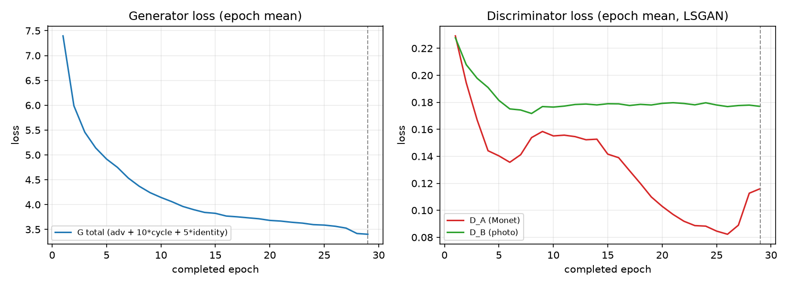{width=95%}

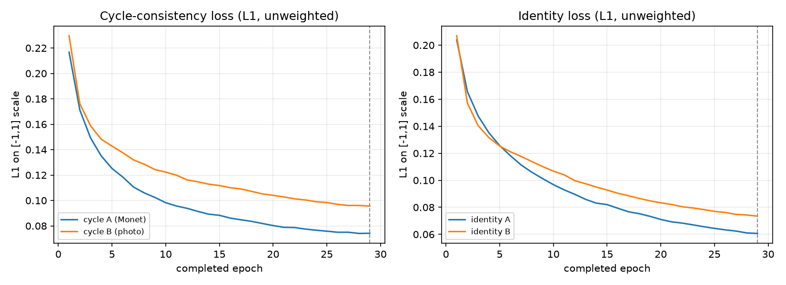{width=95%}

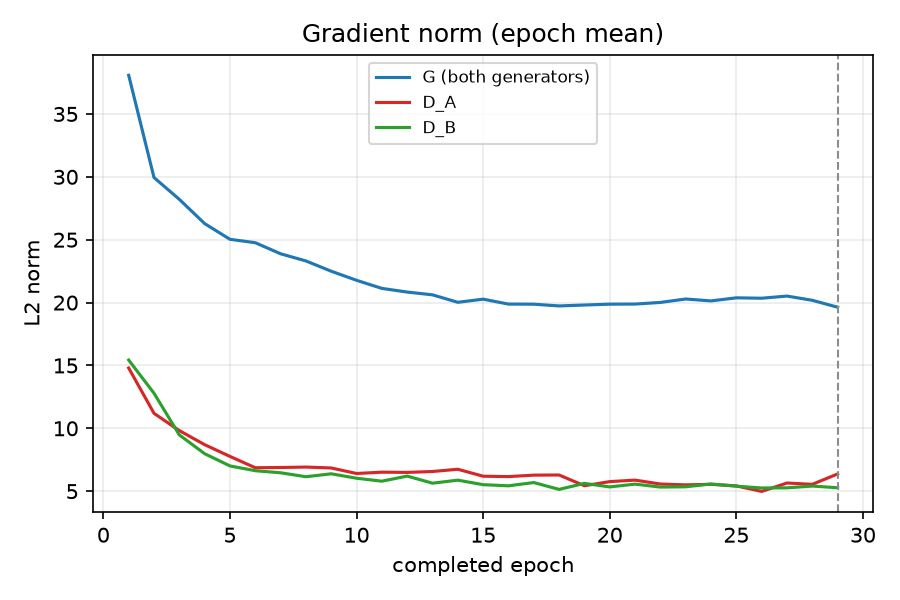{width=62%}

*Khushi.* The generator, cycle and identity losses fall smoothly and the gradient norms level off (generator about 20, discriminators about 5 to 6) with no NaN events. The Monet discriminator loss fell from 0.229 to about 0.082 at epoch 26 and then rose to 0.116 by epoch 29, i.e. D_A became somewhat less confident over the last three epochs while D_B stayed near 0.177. This is a moderate change, not evidence of instability by itself, and it is one reason the neighbouring checkpoints were scored.

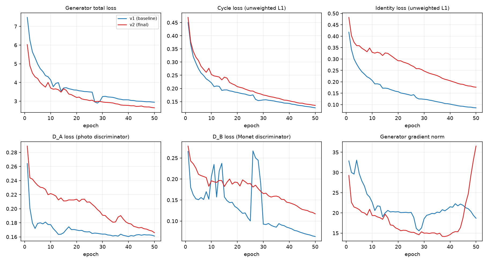{width=98%}

*Dipin.* The raw logs show the effect of the v2 changes. In v1 the Monet discriminator is briefly overpowered (its real-minus-fake score gap fell to 0.012), while v2 with gradient clipping and DiffAugment kept a larger minimum gap (0.102) and recorded no NaN steps in either run. v2 has a lower generator loss (2.645 against 2.943) but a higher unweighted cycle loss (0.136 against 0.126) and a larger identity loss, consistent with the lower identity weight.

## 4.7 Qualitative results

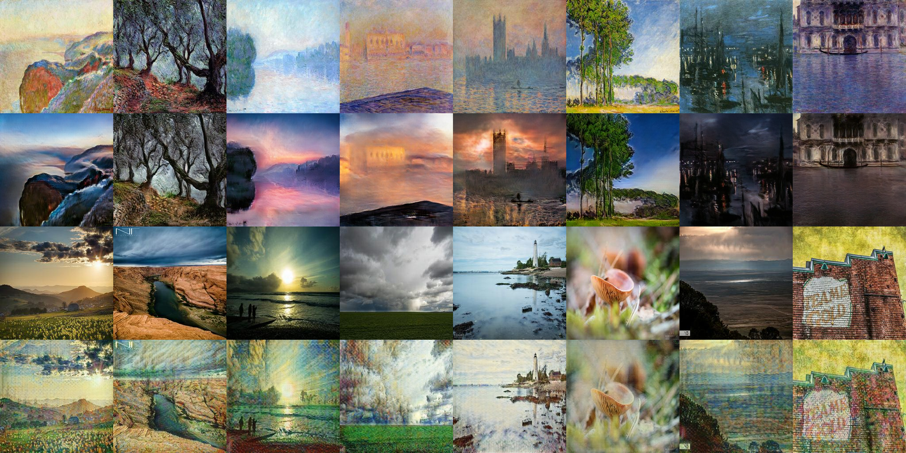{width=98%}

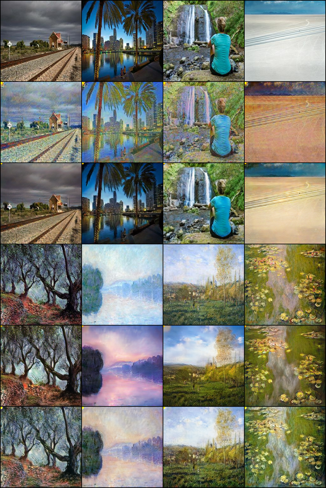{width=58%}

Khushi's model converts photographs into soft, painterly images with Monet-like palettes while keeping layout, and turns Monet paintings into photograph-like images that keep the scene structure. Dipin's v2 gives a stronger painted look with pointillist texture and pastel palettes in the photo-to-Monet direction and shows a small yellow mark in the top-left corner of generated Monet images, an artifact documented in Dipin's analysis.

## 4.8 Failure analysis

**Khushi** (`task3_gan/khushi/failure_analysis.md`; panels from the blinded audit set):

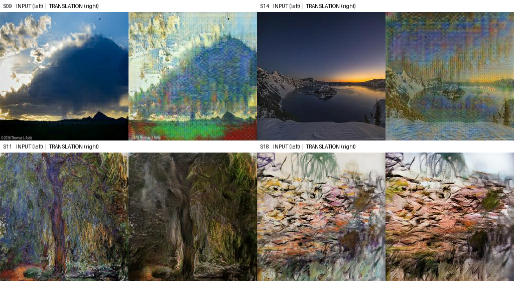{width=82%}

* *Periodic texture over smooth regions (photo to Monet; S09, S14, S27).* A fine grid or stripe pattern covers skies and clouds; in S14 the night sky is replaced by streaks while the snow foreground is kept. The generator uses transposed-convolution upsampling, which is known to produce such patterns (Odena et al., 2016); this is a hypothesis that was not tested.
* *Loss of detail and contrast (S11, S20).* The willow in S11 (Monet to photo) becomes darker and blurrier, and the saturated orange terrace in S20 (photo to Monet) washes out to a pale pastel.
* *Partial style conversion (S18, Monet to photo).* An abstract, heavily textured painting is translated into an output close to the input; content preservation is rated 4 and 5 and style conversion 2 and 1.
* *Rater disagreement on artifacts* (above) means that artifact scores for photo to Monet differ by 1.7 points between raters.

**Dipin** (`task3_gan/dipin/failure_analysis.md`, v1 held-out photos selected automatically by lowest content cosine, highest cycle L1 and highest LPIPS). Low-texture scenes such as salt flats and plain skies have the highest cycle error (up to 0.242 against a median of 0.042) and receive hallucinated texture; saturated sunsets change colour yet reconstruct almost perfectly, showing that a low cycle loss alone does not prove a faithful translation (the "steganography" effect of Chu et al., 2017); letterbox borders and flat-sky streak or checkerboard patterns are further failure modes. The v2 run removed the checkerboard grids but introduced blob artifacts and the fixed yellow corner mark.

## 4.9 Joint analysis

*Strengths.* Both models learn the two mappings and preserve scene content (content cosine 0.75 to 0.83, cycle L1 0.04 to 0.06) without any NaN event. Khushi's model has the best course-evaluator result (average FID 98.61, class metric −49.512) among the three, and the lowest KID in both directions on its fixed in-domain set; Dipin's v2 has the best photo-to-Monet FID under the course evaluator (99.90) and on the held-out photos used in Dipin's protocol (92.03) and the lowest average MiFID (0.4016), at higher training cost than v1.

*Weaknesses and limitations.* The two sets of per-metric numbers use different evaluation sets (in-domain 300 + 300 versus held-out photos), so the ranking by FID, KID, precision and recall between members must be read with that difference in mind; for Khushi the checkpoint was also selected on the evaluation set. With 300 images per set FID is biased and the KID subset standard deviation (0.002 to 0.003) is not small relative to the differences between directions. In Khushi's model FID and KID rank the directions differently (FID lower for Monet to photo, KID lower for photo to Monet), and precision and recall are asymmetric (0.717 / 0.390 for Monet to photo, 0.400 / 0.613 for photo to Monet); this is a descriptive reading of 300-image comparisons and does not establish a mode-coverage difference. Khushi's training stopped at epoch 40 of a planned 200 and never reached the learning-rate decay phase. Each human audit has two raters and 30 samples; agreement is low for Khushi's audit (kappa −0.03 to 0.18) and moderate for Dipin's (0.42 to 0.58), and the two audits use opposite artifact scales.

*Next steps.* Evaluate all models on a common held-out set with the same code; replace transposed convolutions by resize-convolutions in Khushi's generator while keeping a smoothness or perceptual term; use DiffAugment on the Monet discriminator only (the photo critic has 6,538 real images) with a moderate identity weight; and extend Khushi's training into the decay phase.

# 5. Cross-task synthesis

Across the three tasks the same pattern appears: aggregate metrics improve with model capacity or training tricks, but the gains are small relative to their measurement uncertainty, and the informative evidence comes from failure analysis. In Task 1 evaluation-mode cross-entropy shows no overfitting while generated text still repeats templates and loses coherence. In Task 2 a McNemar test shows the 0.15 point accuracy gain of the BiLSTM with attention is not significant (p = 0.060 to 0.082 against the baseline), and the errors are dominated by mixed reviews, label noise and preprocessing choices. In Task 3 distribution metrics computed on 300 images have material uncertainty, differ between FID and KID, and cannot replace inspection of artifacts and the human audit. For all tasks the repository stores checkpoints, raw logs, manifests with SHA-256 values and the executed notebooks, so every table above can be regenerated or checked (section 6).

# 6. Reproducibility and evidence

| Result | Evidence |
|---|---|
| Task 1 metrics, curves, samples | `task1_llm/khushi/outputs/task1_full_20260925_204011/` (`eval_epoch_9/metrics.json`, `curves/`), `task1_llm/khushi/metrics_report.csv`, raw log `reproducibility/raw_logs/khushi/task1_full_20260925_204011.jsonl`, checkpoint `task1_llm/khushi/checkpoints/task1_full_20260925_204011/epoch_9.pt`, manifest `reproducibility/manifests/khushi/manifest.md` |
| Task 2 metrics, plots, errors | `task2_sentiment/dipin/metrics_report.csv`, `outputs/run_summary.json`, `outputs/plots/`, `outputs/error_review/`, raw logs `reproducibility/raw_logs/dipin/task2_*.jsonl`, manifest `reproducibility/manifests/dipin/task2_manifest.json`, checkpoints `task2_sentiment/dipin/checkpoints/` |
| Task 3, Khushi | `task3_gan/khushi/full_metrics_report.csv`, `results.md`, `outputs/official_eval/`, `outputs/final_eval_epoch029/`, `outputs/human_audit/`, `outputs/kaggle/`, raw logs `reproducibility/raw_logs/khushi/task3_khushi_prod_*`, checkpoint-to-result chain `reproducibility/manifests/khushi/task3_checkpoint_result_map.md` |
| Task 3, Dipin | `task3_gan/dipin/metrics_report.csv`, `results.md`, `outputs/eval/`, `outputs/v2/`, raw logs `task3_gan/dipin/outputs/logs/` and `outputs/v2/logs/`, checkpoints `task3_gan/dipin/checkpoints/` |

The executed notebooks are `task1_llm/khushi/task1_khushi.ipynb`, `task2_sentiment/dipin/src/task2_dipin.ipynb`, `task3_gan/khushi/src/task3_khushi.ipynb` and `task3_gan/dipin/src/task3_dipin.ipynb`. A single command, `python smoke_test.py` from the repository root, loads every final checkpoint with its own model code and checks a forward pass; the README lists setup, dataset and evaluation commands.

# References

1. Vaswani, A., Shazeer, N., Parmar, N., Uszkoreit, J., Jones, L., Gomez, A. N., Kaiser, L. and Polosukhin, I. (2017). Attention Is All You Need. *Advances in Neural Information Processing Systems 30*.
2. Eldan, R. and Li, Y. (2023). TinyStories: How Small Can Language Models Be and Still Speak Coherent English? *arXiv:2305.07759*.
3. Zhu, J.-Y., Park, T., Isola, P. and Efros, A. A. (2017). Unpaired Image-to-Image Translation using Cycle-Consistent Adversarial Networks. *IEEE International Conference on Computer Vision (ICCV)*.
4. Mao, X., Li, Q., Xie, H., Lau, R. Y. K., Wang, Z. and Smolley, S. P. (2017). Least Squares Generative Adversarial Networks. *ICCV*.
5. Heusel, M., Ramsauer, H., Unterthiner, T., Nessler, B. and Hochreiter, S. (2017). GANs Trained by a Two Time-Scale Update Rule Converge to a Local Nash Equilibrium. *NeurIPS*.
6. Bińkowski, M., Sutherland, D. J., Arbel, M. and Gretton, A. (2018). Demystifying MMD GANs. *ICLR*.
7. Kynkäänniemi, T., Karras, T., Laine, S., Lehtinen, J. and Aila, T. (2019). Improved Precision and Recall Metric for Assessing Generative Models. *NeurIPS*.
8. Naeem, M. F., Oh, S. J., Uh, Y., Choi, Y. and Yoo, J. (2020). Reliable Fidelity and Diversity Metrics for Generative Models. *ICML*.
9. Zhang, R., Isola, P., Efros, A. A., Shechtman, E. and Wang, O. (2018). The Unreasonable Effectiveness of Deep Features as a Perceptual Metric. *CVPR*.
10. Odena, A., Dumoulin, V. and Olah, C. (2016). Deconvolution and Checkerboard Artifacts. *Distill*.
11. Chu, C., Zhmoginov, A. and Sandler, M. (2017). CycleGAN, a Master of Steganography. *arXiv:1712.02950*.
12. Zhang, X., Zhao, J. and LeCun, Y. (2015). Character-level Convolutional Networks for Text Classification. *NeurIPS* (Yelp Polarity).
13. Bahdanau, D., Cho, K. and Bengio, Y. (2015). Neural Machine Translation by Jointly Learning to Align and Translate. *ICLR*.
14. Hochreiter, S. and Schmidhuber, J. (1997). Long Short-Term Memory. *Neural Computation* 9(8).
15. McNemar, Q. (1947). Note on the sampling error of the difference between correlated proportions or percentages. *Psychometrika* 12.
16. Cohen, J. (1968). Weighted kappa: nominal scale agreement with provision for scaled disagreement or partial credit. *Psychological Bulletin* 70.
